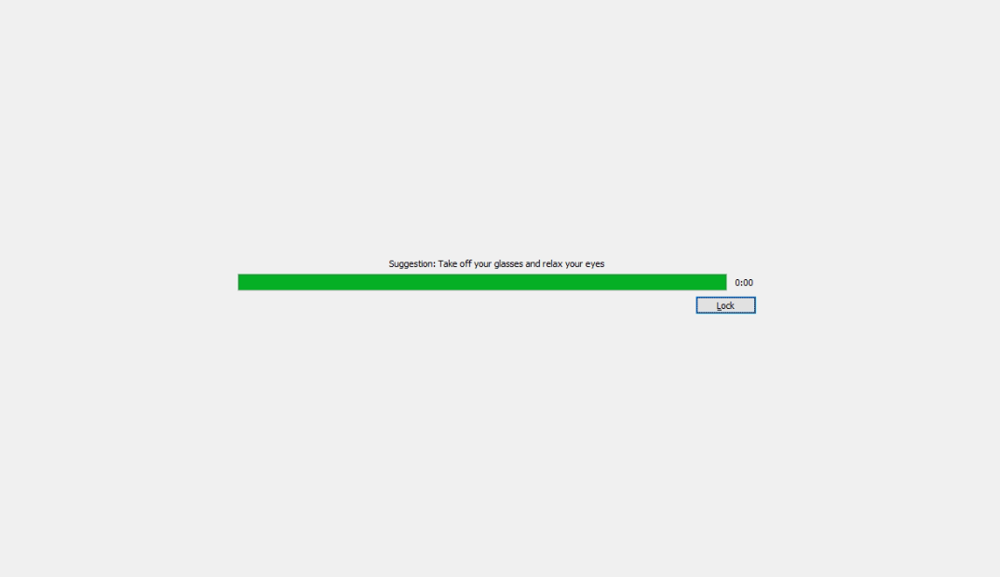
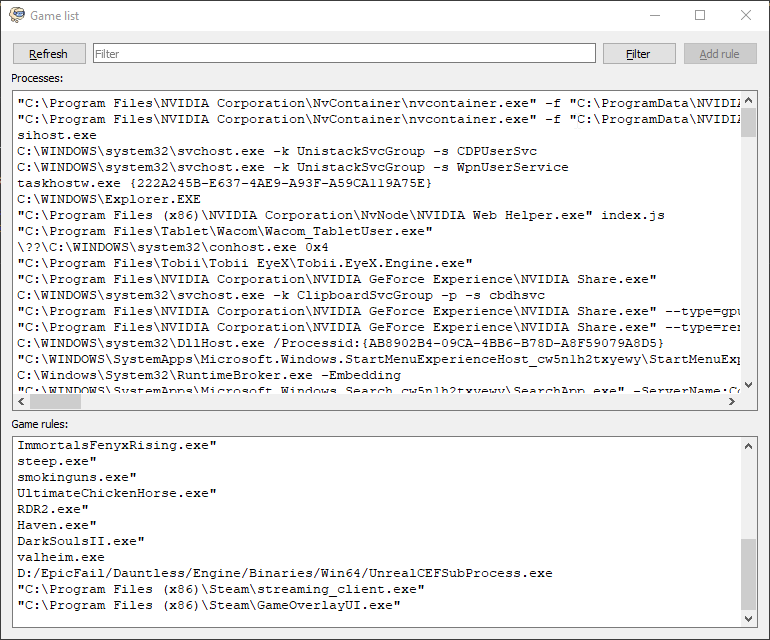
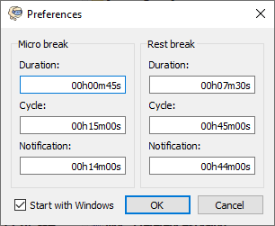
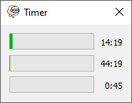

# WorkraveQt

Modern reimplementation of [Workrave](https://workrave.org) in Qt. It is designed to help with Repetitive Strain Injury (RSI), but in a much stricter way than the original Workrave implementation.



 

 

## Getting started

You can download one of the [releases](https://github.com/mrexodia/WorkraveQt/releases), extract it anywhere and open `WorkraveQt`.

## Linux Installation

### Install from source

1. Install Qt development packages:
   ```bash
   # Fedora
   sudo dnf install qt6-qtbase-devel

   # Ubuntu/Debian
   sudo apt install qt6-base-dev

   # Arch
   sudo pacman -S qt6-base
   ```

2. Build and install:
   ```bash
   ./scripts/install-linux.sh --user
   ```

This installs to `~/.local/` and sets up autostart on login. The app will appear in your application menu.

To uninstall:
```bash
./scripts/uninstall-linux.sh --user
```

For system-wide installation to `/usr/` (requires root):
```bash
./scripts/install-linux.sh --system
```

## Building (Other Platforms)

1. Install a recent version of [Qt](https://www.qt.io/offline-installers) (you can bypass the account requirement by setting `0.0.0.0` as a proxy)
2. (Optional) [Configure Qt Creator](https://doc.qt.io/qtcreator/creator-configuring.html)
3. Open `src/WorkraveQt.pro` in Qt Creator

### Portable Qt installation (Windows)

To avoid using Qt's official setups that require an account you can use [aqtinstall](https://github.com/miurahr/aqtinstall).

```
pip install aqtinstall
aqt install-qt windows desktop 5.12.12 win64_msvc2017_64
aqt install-tool windows desktop tools_qtcreator_gui
```

You can find more available Qt configurations [here](https://ddalcino.github.io/aqt-list-server/).